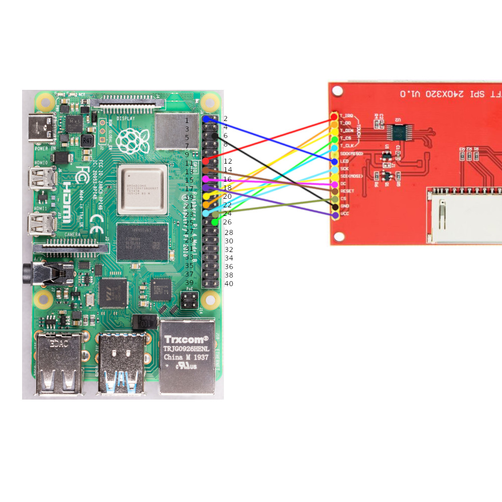

# PItoLCD
Connecting a Pi to generic 3.2" LCD panel

## LCD connections

LCD---PI PIN (NOT GPIO NUMBER)
=============================
T_IRQ----11
T_DO/OUT-21
T_DN/DIN-19*
T_CS-----26
T_CLK----23^
SDO(MISO) N/C
LED------1 (3.3v)
SCK------23^
SDI------19*
D/C------15
RESET----13
CS-------24
GND------6 (gnd)
VCC------17 (3.3v)

Note 2 wires to PI pins 23 and 19

to use..
Use RaspiOS BULLSEYE.
git clone https://github.com/waveshare/LCD-show.git
cd LCD-show/
sudo ./LCD28-show

Calibrate touchscreen after connecting
